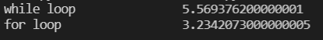
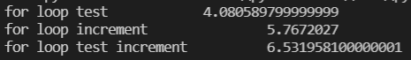
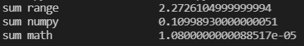
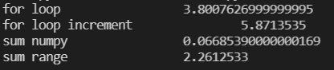

# **Python Loops Test**
We are going to test some methods in Python for the sum of numbers from 0 to n

## **1.** First experiment
In the first experiment are compared the for loop and the while loop 
  
 
**For loop is faster** cause the variable incrementation inside the loop is done in c, on the other hand, while condition and incrementations are done in python

## **2.** Second experiment
In this experiment are compared three different implementations of for loops with redundant operations
  
 
As we see, time increased...
## **3.** Third experiment
Third experiment is about comparsion of three different sum methods
  
 

## **4.** Fourth experiment 
Comparsion of some past tests
  
 
As we see, numpy method is faster than others (numpy is written in c too)  
**So the fastest way to loop in Python is to loop in C** 
**:)**
 

## **Links**
[Link for soruce](https://www.youtube.com/watch?v=Qgevy75co8c)